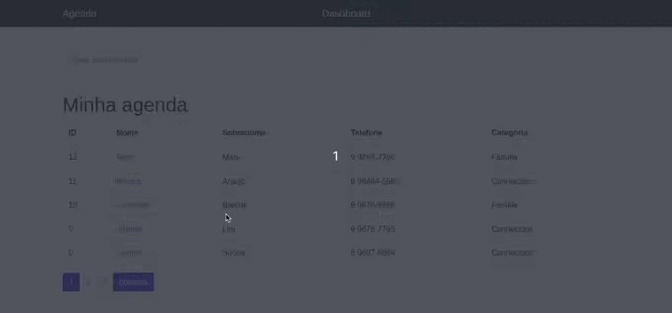

<h1 align="center">
    📔 <a href="https://projeto-agenda-werberty.herokuapp.com/" target="_blank">Projeto Agenda</a>
</h1>

📒 Site agenda de contatos

 <a href="#objetivo">Objetivo</a> •
 <a href="#funcionalidades">Funionalidades</a> • 
 <a href="#layout">Layout</a> • 
 <a href="#tecnologias">Tecnologias</a> • 

<h2 id="objetivo">📝 Objetivo</h2>

É uma agenda que contem uma lista de contatos com várias informações, no site é possível se cadastrar ou logar com uma conta e adicionar mais contatos a lista, foi implementado funções como paginação, barra de pesquisa e além de ver mais detalhes do contato.

<h2 id="funcionalidades">⚙️ Funcionalidades</h2>

- [x] Criar usuário
- [x] Adicionar contatos na agenda
- [x] Ver detalhes do contato
- [x] Paginação

<h2 id="layout">🖼️ Layout</h2>

<h1 align="center">
  
</h1>

<h2 id="tecnologias">🛠 Tecnologias</h2>

As seguintes ferramentas foram usadas na construção do projeto:

- [Python](https://www.python.org/)
- [Django](https://www.djangoproject.com/start/overview/)
- [HTML5](https://developer.mozilla.org/pt-BR/docs/Web/HTML)
- [CSS3](https://developer.mozilla.org/pt-BR/docs/Web/CSS)
- [Bootstrap](https://getbootstrap.com/)

