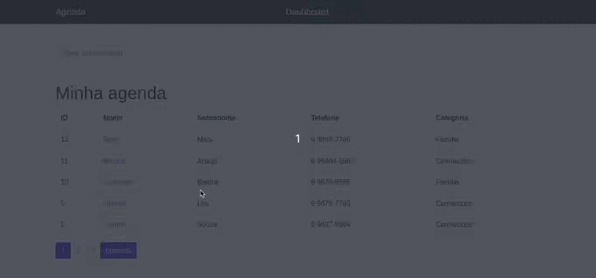

# :ledger: Projeto Agenda

## :clipboard: Sobre o projeto

É uma agenda que contem uma lista de contatos com várias informações, no site é possível se cadastrar ou logar com uma conta e adicionar mais contatos a lista, foi implementado funções como paginação, barra de pesquisa e além de ver mais detalhes do contato.

## :camera: Layout web

## :computer: Tecnologias utilizadas
- Python
- Django
- HTML
- CSS
- Bootstrap
- Banco de dados: SQlite3

